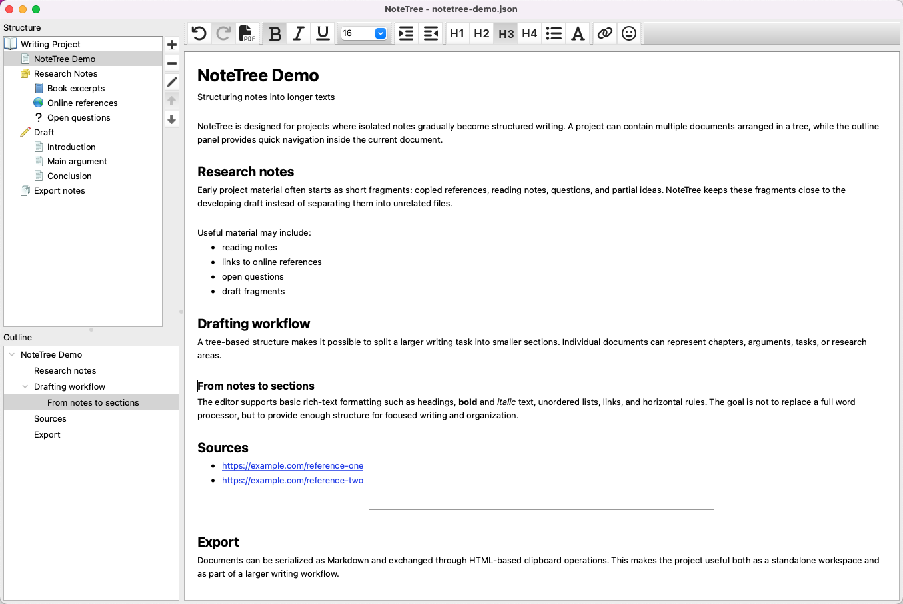

# NoteTree

NoteTree is a desktop writing and knowledge-organization application built with a custom PyQt6 editor experience. It helps structure notes, references, and longer drafts in a tree-based workspace with a custom rich-text editor, outline navigation, and Markdown/HTML import and export.

It started as a personal tool for collecting notes from books and online sources, structuring them into meaningful sections, and turning them into seminar material or longer essays. The current version focuses on the core foundation: project files with a document tree, rich-text editing and outline navigation.

## Overview

A NoteTree project consists of multiple rich-text documents arranged hierarchically. This is useful for writing and research tasks where information needs to be split into smaller sections without losing the larger structure.

Example use cases:

- preparing a seminar or workshop
- collecting and organizing reading notes
- drafting essays or longer texts
- structuring personal research or project material

## Screenshot


## Features

### Project workspace

- Create, open, save, and save-as project files
- Store multiple documents in a single project
- Restore recently opened files
- Restore window geometry and the last opened documents between sessions

### Document tree

The document hierarchy is shown in a tree view where nodes can be added, edited, removed, and rearranged by drag and drop.

A node consists of a document title and a selectable icon. A built-in icon selection is available, and custom icons can be added or removed through the dedicated icon manager.

### Rich-text editor

The editor supports the following formatting features:

- Heading levels 1-4
- Bold and italic text
- Font size changes
- Unordered lists
- Horizontal rules
- Inline links

A single document can also be exported as PDF using Qt’s printing/PDF infrastructure.

Copy, cut, and paste use HTML and plain-text MIME data. Markdown is used for document serialization and import/export workflows. Both Markdown and HTML handling follow the editor’s supported formatting model.

### Outline navigation

NoteTree generates an outline from the headings in the current document.

The outline panel makes longer documents easier to navigate:

- headings are shown as a structured outline
- selecting an outline entry moves the editor cursor to that section

### Markdown and HTML support

NoteTree includes custom Markdown and HTML import/export logic for the editor’s focused formatting subset.

Supported Markdown-related features include:

- headings
- bold and italic inline formatting
- inline links
- unordered lists
- horizontal rules
- selected inline HTML spans used by the editor for font-size information

### Tests

The repository includes automated tests for the Markdown-related logic:

- Markdown importer
- Markdown exporter
- Markdown inline parser

These tests focus on the parsing and serialization behavior that is central to the editor’s Markdown interoperability.

## Running the application

This repository currently contains the application source code, but it is not yet packaged as an installable desktop application.
From the repository root, create a virtual environment and install the required runtime dependency:

```bash
python -m venv .venv
source .venv/bin/activate

python -m pip install --upgrade pip
python -m pip install PyQt6
```

Then run the application:

```bash
python -m notetree.app
```

On Windows, activate the virtual environment with:

```bash
.venv\Scripts\activate
```

## Running tests
Install the test dependency:

```bash
python -m pip install pytest
```

Run the test suite from the repository root:

```bash
python -m pytest
```

## Technical focus

NoteTree is most interesting as a structured PyQt6 desktop application with custom editor, parser, and serialization logic - not as a replacement for established note-taking tools.
The project demonstrates work in several areas:

- PyQt6 desktop UI structure
- document tree model and view logic
- custom rich-text editor behavior
- custom PyQt6 widgets
- heading-based outline generation
- Markdown import/export
- HTML import/export
- inline formatting resolution
- project file serialization
- session and settings handling
- icon library and icon manager UI
- automated parser/exporter tests

The codebase is organized around these concerns, with separate modules for the document tree, text editor, Markdown/HTML handling, outline panel, project/session logic, common widgets, and icon management.

### Custom Markdown/HTML parsing

Markdown and HTML handling is implemented directly instead of delegated to Qt's built-in conversion behavior. This gives the editor predictable control over the formatting features it supports and keeps import/export behavior aligned with NoteTree's own document model. The implementation includes custom inline parsing, formatting resolution, and tests for importer/exporter behavior.

## Current limitations

NoteTree is functional, with an editor focused on a defined set of formatting features. It does not cover the full range of Markdown or HTML.
Current limitations include:

- Unsupported Markdown constructs are treated as plain text.
- Ordered lists, blockquotes, tables, and broader HTML/CSS support are not implemented.
- Linked images are recognized by parts of the import logic but are not exported as editor content.
- The repository does not provide a packaged installer.
- Automated tests currently focus on Markdown parsing/import/export rather than full UI behavior.

## Roadmap

Possible future improvements include:

- implementing backlinks and a keyword index
- improving the visual design
  - for example, reducing borders and visual noise
- extending editor support for ordered lists, blockquotes, tables, and images
  - and extending the Markdown/HTML parsers accordingly
- expanding automated tests beyond Markdown logic

Backlinks and a keyword index are especially relevant to the original purpose of the project: collecting notes from books and online sources, then organizing them into meaningful structures. A keyword could work like a tag: a lightweight marker that links related topics across different projects.

## License / third-party assets
This repository includes third-party icon assets. See [THIRD_PARTY_NOTICES.md](THIRD_PARTY_NOTICES.md) for attribution and license information related to bundled assets.
